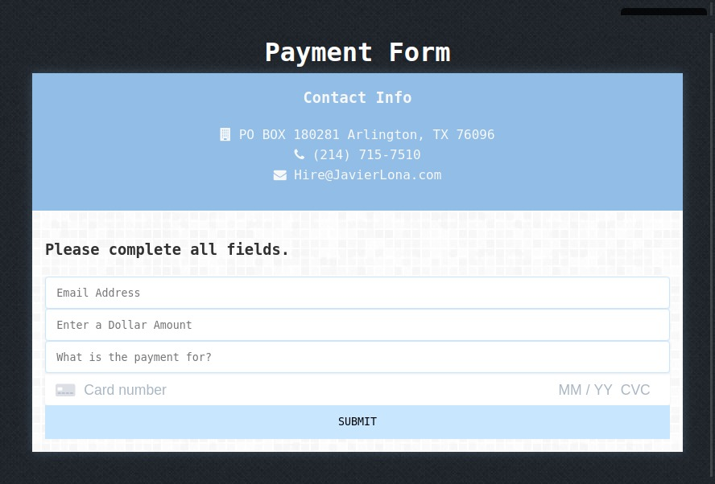

[Live Demo Here](http://onegreatapp.com/stripe-online-payment-app)

# stripe-online-payment-app
The app accepts an amount from $1 - $10,000 and automatically emails the user a receipt. The app verifies the user entered a valid amount, email, and description. 

## Installation
Download and install [composer](https://getcomposer.org/download/) to the directory where the app is going to run.

Afterwards go to the [PHP Stripe Library](https://github.com/stripe/stripe-php) and run the commands listed under "Composer".

## Usage
Use the test card numbers provide by [Stripe](https://stripe.com/docs/testing)
